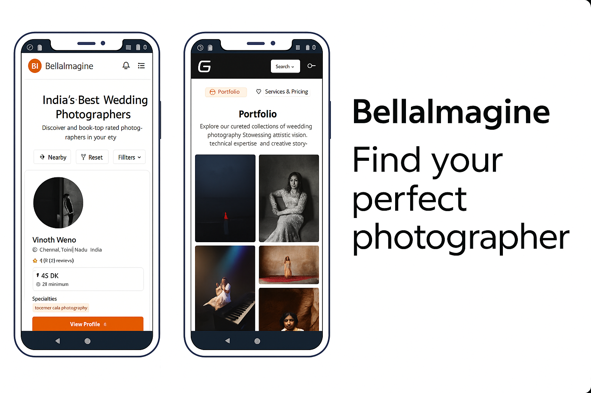

# Bella Imagine



**Bella Imagine** is a modern photography service platform that connects clients with professional photographers across India. It offers real-time collaboration, AI-driven recommendations, and secure project management, designed for scalability and an exceptional user experience.

## Table of Contents
- [Key Features](#key-features)
- [Tech Stack](#tech-stack)
- [Getting Started](#getting-started)
- [Environment Configuration](#environment-configuration)
- [License](#license)

## Key Features

- **Photographer Discovery & Booking**  
  Discover photographers by category, style, and location with advanced filtering and sorting. Features location-based autocomplete search powered by Google Maps SDK and nearby photographer suggestions, along with AI-driven budget-based recommendations.

- **Complex Service Creation & Work Samples**  
  Photographers can create detailed services and showcase portfolios with text and media posts, styled similarly to Reddit content.

- **Community Interaction**  
  A wide range of communities for users to interact, post text and media content, and engage socially.

- **Real-Time Chatting**  
  Instant messaging for seamless communication between clients and photographers.

- **Payment Integration**  
  Secure payments via Stripe, with webhook handling for transaction updates.

- **Secure Role-Based Access**  
  Ensures access control and data integrity for clients, photographers, and admins.

## Tech Stack

### Frontend
-  **with TypeScript** For building a dynamic and type-safe user interface.
-  For efficient data fetching and state management.
-  For global state handling across the application.
-   For modern, responsive, and customizable UI components.
-  For location-based autocomplete search and nearby photographer features.

## Getting Started

### Prerequisites
- Node.js
- Google Maps API key
- Stripe Public Key
- Google Client ID for authentication

### Installation

```bash
git clone https://github.com/your-username/bella-imagine.git
cd bella-imagine
npm install
```

### Environment Configuration
Create a `.env` file in the project root and add the following environment variables:

```plaintext
VITE_ADMIN_API_URI=http://localhost:3002/api/v_1/_pvt/_ad/admin
VITE_CLIENT_API_URI=http://localhost:3002/api/v_1/_pvt/_cl
VITE_VENDOR_API_URI=http://localhost:3002/api/v_1/_pvt/_ve
VITE_AUTH_API_URI=http://localhost:3002/api/v_1/auth
VITE_CHAT_API_URL=http://localhost:3002/api/v_1/_chat
VITE_GOOGLE_CLIENT_ID=your-google-client-id
VITE_STRIPE_PUBLIC_KEY=your-stripe-public-key
VITE_GOOGLE_MAP_API_KEY=your-google-maps-api-key
```

## License

This project is licensed under the [MIT License](LICENSE).